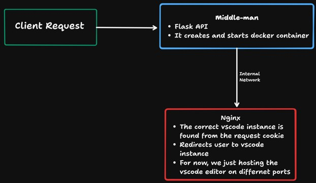

## Introduction

This is a simple python project that uses Docker to create a container with a web server running VS Code Server. The web server is configured to proxy requests to the VS Code Server running in the container.

## Technologies Used

- Python
- Docker
- Nginx

### Simple Diagram

